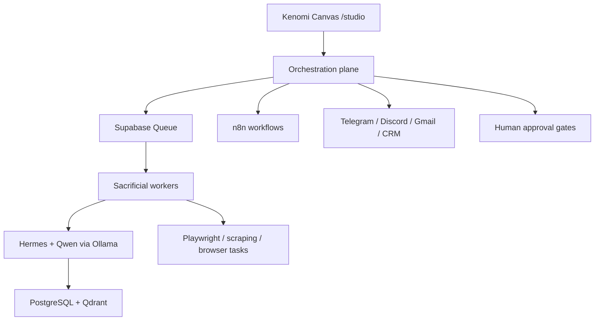
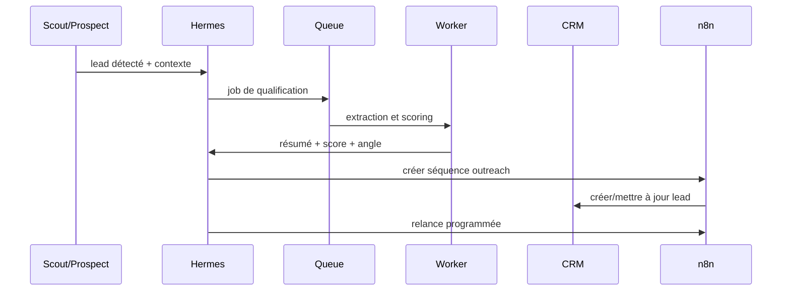
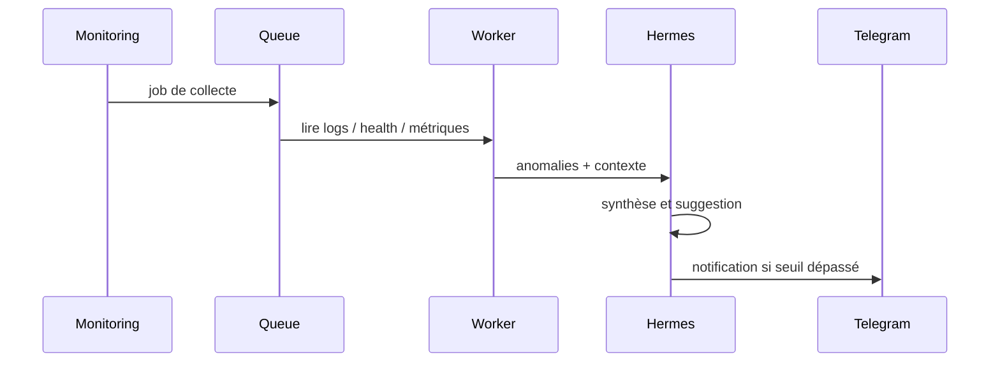
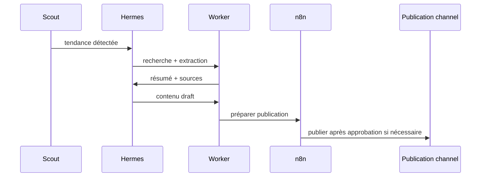

# Kenomi Autonomous AI Infrastructure — Design

**Date** : 2026-05-24  
**Statut** : draft approuvé pour review  
**Portée** : architecture globale du système autonome Kenomi, intégrée à l'app existante, avec `Hermes` comme agent de raisonnement principal.

## Objectif

Construire une plateforme IA autonome, privée et exploitable 24/7, capable d'aider Kenji à générer du revenu, automatiser l'acquisition client, assister les opérations DevOps/HomeLab, produire du contenu technique et orchestrer des agents spécialisés sans exposer l'infrastructure centrale.

Le système doit s'appuyer sur ce qui existe déjà dans `kenomi-canvas` au lieu de recréer une seconde plateforme parallèle. L'app actuelle devient le **control plane** humain et administratif; les workers et automatisations constituent le **data/execution plane** isolé.

## Contexte actuel

L'app `kenomi-canvas` contient déjà plusieurs briques structurantes:

- `/studio/agents` pour piloter les agents et leurs runs.
- `/studio/automations` pour les workflows déclenchables.
- `/studio/infrastructure` pour le monitoring et les actions de réparation.
- `/studio/analytics` pour le suivi des métriques.
- `lib/agent-orchestration.ts` pour la logique d'exécution planifiée.
- `lib/llm-client.ts` pour l'abstraction LLM avec Ollama en primaire et fallback externe.
- `lib/infra-config.ts` pour la cartographie des services d'infra.
- `lib/security.ts` et `docs/security.md` pour les garde-fous SSRF, secrets et actions à risque.
- `lib/pipeline-types.ts` et les écrans associés pour la chaîne venture/scout/validation/builder/payment/marketing/decision.

L'infrastructure physique et logique déjà documentée comprend:

- Proxmox comme hyperviseur.
- Coolify comme orchestrateur de déploiement.
- Supabase comme base de données, auth et file d'exécution.
- n8n pour les workflows d'automatisation.
- Ollama pour l'inférence locale.
- Tailscale pour le réseau Zero Trust.
- des workers isolés et sacrifiables pour l'exécution.

Cette spec doit rester cohérente avec ces éléments, et non les contredire.

## Principes de conception

1. Le système n'expose jamais Proxmox ou les secrets centraux aux workers.
2. Tout appel externe sensible passe par une couche de politique, d'audit et de validation humaine si nécessaire.
3. Le raisonnement LLM est séparé de l'exécution.
4. Les tâches longues ou répétables sont asynchrones et idempotentes.
5. Les données opérationnelles et l'historique d'exécution vivent dans PostgreSQL/Supabase.
6. La mémoire long terme est explicite, interrogable et segmentée par domaine.
7. Les modèles coûteux ne sont utilisés que pour les étapes où leur valeur est réelle.
8. Le système doit rester simple à faire tourner dans un homelab, sans Kubernetes.

## Architecture cible

La plateforme se compose de cinq plans distincts:

1. **Control plane** — l'app Next.js existante, qui expose le cockpit opérateur, les tableaux de bord, les approvals et les vues d'audit.
2. **Orchestration plane** — Supabase Queue, n8n et les jobs planifiés; ils décident quoi exécuter, quand, et dans quel ordre.
3. **Execution plane** — workers jetables et spécialisés; ils exécutent scraping, extraction, génération, publication, monitoring et opérations contrôlées.
4. **Reasoning plane** — `Hermes` comme agent maître de planification, triage, scoring et synthèse; `Qwen` pour le volume et les transformations moins critiques.
5. **Memory and telemetry plane** — PostgreSQL, Qdrant, tables d'audit, métriques et historique d'exécution.

Le flux standard est:

## Intégration avec l'app existante

L'app actuelle ne change pas de rôle. Elle devient le point d'entrée unique pour l'opérateur humain.

### `/studio/agents`

Cette vue devient le cockpit de supervision des agents:

- configuration par agent;
- état des runs;
- files d'attente;
- actions en attente d'approbation;
- résultats et erreurs;
- coût LLM par run;
- historique et niveau de confiance.

La chaîne venture existante reste utile pour le workflow de génération d'offres, mais elle n'est qu'une des chaînes spécialisées du système global.

### `/studio/automations`

Cette vue pilote les workflows n8n et les jobs autonomes. Elle doit représenter:

- les déclencheurs;
- les exécutions;
- les retries;
- les erreurs;
- les artefacts publiés;
- les étapes nécessitant validation humaine.

### `/studio/infrastructure`

Cette vue sert à surveiller l'état du homelab et à exposer des actions de réparation contrôlées. Elle ne doit pas permettre à un worker d'agir directement sur Proxmox; elle n'émet que des intentions d'action soumises à policy.

### `/studio/analytics`

Cette vue agrège:

- coût d'inférence;
- temps de cycle;
- volume de leads;
- conversions;
- rendement par agent;
- incidents;
- revenu lié aux actions du système.

### `/dashboard/*`

Le back-office admin reste séparé. Il peut exposer des diagnostics, des configurations et des vues de contrôle avancées, mais pas élargir les permissions d'exécution.

## Rôle de `Hermes`

`Hermes` est le modèle/agent de raisonnement principal. Il ne remplace pas les autres modèles; il les arbitre.

### Ce que fait `Hermes`

- décomposition de tâches;
- planification multi-étapes;
- scoring de prospects;
- arbitrage entre outils et sous-agents;
- synthèse de plusieurs sources;
- décision de continuation/pivot/stop;
- rédaction de prompts de mission pour les autres agents;
- validation finale de messages de prospection et de propositions.

### Ce que `Hermes` ne fait pas

- aucun accès direct aux secrets infra;
- aucun accès direct à Proxmox;
- aucun appel externe sans policy;
- aucune exécution locale à effet de bord sans worker ou n8n;
- aucune lecture libre de tout le data lake sans filtre métier.

### Répartition des modèles

- `Hermes`: raisonnement, stratégie, orchestration, décisions.
- `Qwen`: extraction, résumé, génération de contenu, assistance code/docs, volume.
- fallback externe: uniquement si l'usage est explicitement autorisé et loggé.

`lib/llm-client.ts` doit devenir le point de routage logique vers le modèle approprié, avec séparation claire entre:

- modèle de raisonnement;
- modèle de volume;
- fallback dégradé;
- mesure du coût.

## Composants du système

### 1. Control plane web

Responsabilités:

- authentifier l'opérateur;
- afficher l'état système;
- lancer les tâches autorisées;
- visualiser jobs, runs, approvals et métriques;
- stocker les préférences utilisateur et les paramètres d'infra;
- déclencher des actions de repair ou de publication via des intentions.

Non-responsabilités:

- exécution lourde;
- scraping;
- publication directe sans policy;
- accès aux hosts infra centraux.

### 2. Orchestrateur

Responsabilités:

- transformer une intention en job concret;
- router vers le bon agent spécialisé;
- gérer priorités, retries et délais;
- mettre en file dans Supabase Queue;
- appeler n8n pour les workflows métier;
- déclencher les jobs récurrents;
- réconcilier les statuts entre queue, UI et mémoire.

### 3. Workers spécialisés

Responsabilités:

- exécuter des tâches isolées et jetables;
- collecter du contenu web;
- générer des résumés, brouillons, assets et artefacts;
- calculer des scores;
- écrire les résultats dans PostgreSQL/Supabase;
- poster des notifications vers les canaux autorisés.

Contraintes:

- aucun root global;
- aucun montage de l'hôte;
- aucun accès libre à Proxmox;
- aucun secret non segmenté;
- réseau limité par ACL Tailscale.

### 4. Mémoire long terme

Responsabilités:

- stocker les conversations, décisions, signaux, leads, contenus, incidents et résultats;
- permettre la recherche sémantique;
- servir de contexte aux agents;
- conserver les preuves et les justifications de décision.

Implémentation cible:

- PostgreSQL pour l'état transactionnel et l'audit;
- Qdrant pour la mémoire sémantique et la récupération contextuelle;
- tables dédiées pour les événements métiers, les runs et les artefacts.

### 5. Canaux externes

Les actions de sortie passent par des connecteurs contrôlés:

- Telegram pour notifications opérationnelles;
- Discord pour alertes ou communautés;
- Gmail APIs pour prospection et relances;
- CRM léger dans PostgreSQL ou Supabase pour le pipeline commercial;
- n8n pour l'enchaînement des workflows et l'intégration SaaS.

## Agents à construire

### Prospect Agent

Mission prioritaire: générer des leads qualifiés et faire avancer le pipeline commercial.

Responsabilités:

- veille d'opportunités;
- scraping de sources autorisées;
- détection de besoins PME;
- scoring de rentabilité;
- génération d'outreach personnalisé;
- suivi de réponses;
- relances automatiques;
- rédaction de proposition commerciale;
- passage du lead dans le CRM.

### DevOps Agent

Mission: surveiller et assister l'infrastructure.

Responsabilités:

- monitoring Docker et services;
- analyse de logs;
- détection d'anomalies;
- santé système;
- suggestion de fixes;
- résumé d'incidents;
- optimisation de ressources.

### Content Agent

Mission: produire du contenu technique et renforcer la présence de Kenomi.

Responsabilités:

- posts LinkedIn;
- articles techniques;
- documentation infra;
- publication GitHub;
- veille cybersécurité;
- études de cas;
- asset pipeline pour marketing.

### Scout Agent

Mission: détecter des opportunités business/SaaS.

Responsabilités:

- analyse de tendances;
- veille Reddit/Product Hunt/autres sources autorisées;
- détection de niches;
- validation d'idée SaaS;
- analyse de concurrence;
- pré-score de marché.

### Hermes Agent

Mission: agent de raisonnement au-dessus de tous les autres.

Responsabilités:

- sélectionner le bon agent;
- découper les tâches;
- arbitrer les priorités;
- fusionner les signaux;
- proposer les décisions stratégiques;
- produire la note opérateur finale.

## Workflow prioritaires

### Workflow 1 — Acquisition client

Étapes:

1. détection du lead;
2. enrichissement de la société;
3. détection des pains;
4. scoring business;
5. génération du message;
6. création ou mise à jour CRM;
7. relance automatique;
8. suivi de réponse;
9. proposition commerciale si intérêt.

### Workflow 2 — Monitoring IA

### Workflow 3 — Content Pipeline

## Sécurité et Zero Trust

La sécurité n'est pas un thème secondaire; c'est une partie de l'architecture.

### Interdictions structurelles

- aucun accès root global pour les workers;
- aucun montage `/` de l'hôte;
- aucun accès Proxmox direct depuis l'exécution;
- aucun secret partagé entre domaines;
- aucun SSH global depuis les workers;
- aucun accès NAS complet;
- aucun appel réseau non explicitement autorisé.

### Obligations

- workers jetables;
- sandbox d'exécution;
- audit logs systématiques;
- permissions minimales;
- segmentation réseau;
- ACL Tailscale par rôle;
- validation humaine des actions critiques.

### Classes d'action

1. **Read-only**: lecture de santé, logs publics, données métiers autorisées.
2. **Low-risk write**: création de drafts, notifications, mise à jour CRM, insertion de jobs.
3. **Sensitive write**: publication, emailing externe, budget, déploiement, redémarrage de service.
4. **Critical**: toute action qui touche aux secrets, à la plateforme centrale ou à l'infrastructure physique.

Les classes 3 et 4 exigent soit une policy stricte, soit une approval humaine, soit les deux.

### Audit

Chaque exécution doit journaliser:

- source de la demande;
- agent responsable;
- modèle utilisé;
- inputs normalisés;
- output résumé;
- durée;
- coût estimé;
- décision de policy;
- résultat final;
- erreurs et retries.

## Stratégie mémoire

La mémoire doit séparer trois niveaux:

### 1. Mémoire transactionnelle

Dans PostgreSQL/Supabase:

- jobs;
- runs;
- actions;
- approvals;
- prospects;
- conversations;
- décisions;
- artefacts;
- coûts.

### 2. Mémoire sémantique

Dans Qdrant:

- résumés de conversations;
- notes de prospects;
- fragments de documents;
- signaux concurrentiels;
- motifs d'incident;
- prompts validés;
- preuves et objections.

### 3. Mémoire opérateur

Dans l'app:

- vues synthétiques;
- derniers événements;
- décisions humaines;
- next actions;
- historique de contrôles.

Règle: une information utile à la décision doit exister au moins une fois en forme structurée, même si elle existe aussi en texte.

## Données et schéma

Le schéma cible doit être organisé autour de quelques ensembles:

- `agent_configs`
- `agent_runs`
- `agent_events`
- `autonomy_jobs`
- `autonomy_actions`
- `human_approvals`
- `prospects`
- `prospect_contacts`
- `crm_deals`
- `content_drafts`
- `content_published`
- `system_signals`
- `infra_health_checks`
- `knowledge_chunks`
- `memory_embeddings`

Les tables existantes de `kenomi-canvas` doivent être réutilisées quand elles existent déjà et que leur rôle est cohérent. L'objectif n'est pas de dupliquer les concepts, mais d'étendre ce qui est en place.

## Topologie réseau

Le réseau doit suivre une logique de confiance décroissante:

1. cockpit humain sur les appareils admin;
2. control plane app;
3. orchestration plane;
4. workers isolés;
5. services d'inférence et de stockage autorisés;
6. canaux externes en sortie seulement si autorisés.

Règles:

- Proxmox n'est accessible qu'au cockpit humain et aux comptes explicitement autorisés.
- les workers ne voient que les endpoints nécessaires à leurs missions.
- `Hermes` n'a pas de privilèges d'exécution supérieurs à ceux de l'orchestrateur.
- Tailscale est le mécanisme de segmentation réseau principal.

## Observabilité

L'observabilité doit couvrir:

- santé des services;
- latence des jobs;
- taux d'échec;
- temps de réponse LLM;
- consommation mémoire;
- coût d'inférence;
- coût par prospect;
- conversion par canal;
- couverture des approbations;
- backlog de queue;
- erreurs réseau et politiques.

La page `/studio/infrastructure` reste la source de vérité opérateur pour l'état des services, et `/studio/analytics` devient le cockpit économique.

## Déploiement et scaling

Le déploiement doit rester simple:

- Next.js sur Coolify;
- Supabase self-hosted;
- n8n sur sa propre surface;
- workers comme services séparés;
- inférence locale sur Ollama;
- montée en charge horizontale par ajout de workers spécialisés.

La montée en charge ne doit pas introduire Kubernetes trop tôt. On scale d'abord par:

1. séparation des rôles;
2. duplication de workers;
3. priorités de queue;
4. optimisation des modèles;
5. réduction des appels coûteux;
6. seulement ensuite, si nécessaire, un orchestrateur plus complexe.

## Coûts d'inférence

La politique coût doit être explicite:

- `Hermes` est réservé aux tâches à forte valeur ajoutée;
- `Qwen` traite les tâches répétitives et de volume;
- les prompts sont courts et structurés;
- le contexte est récupéré depuis la mémoire au lieu d'être recopié;
- les sorties sont validées par schéma pour éviter les retries coûteux;
- chaque run stocke le coût estimé.

Objectif: rendre le coût par action prévisible et mesurable, pas subir l'inférence comme une dépense opaque.

## Modèle économique

Le système doit aider à vendre:

- infrastructures IA privées;
- monitoring PME;
- automatisation entreprise;
- DevOps self-hosted;
- cybersécurité PME;
- agents IA personnalisés;
- dashboards intelligents.

Le pipeline économique cible:

1. trouver l'opportunité;
2. qualifier l'intérêt;
3. produire une offre lisible;
4. contacter le prospect;
5. faire relance et nurturing;
6. transformer en lead chaud;
7. proposer un service ou une mission;
8. tracer le revenu attribuable.

Le système doit donc mesurer non seulement l'activité, mais aussi le revenu effectivement créé par chaque boucle.

## Phases de livraison

### Phase 1 — Control plane unifié

- conserver l'app actuelle comme cockpit;
- aligner les vues agents/automations/infrastructure/analytics;
- normaliser les modèles de données d'agent;
- intégrer `Hermes` comme modèle de raisonnement configurable;
- journaliser proprement les runs et décisions.

### Phase 2 — Acquisition client prioritaire

- implémenter le `Prospect Agent`;
- connecter les sources autorisées;
- mettre en place scoring, relances et CRM minimal;
- ajouter les approvals sur les actions sensibles;
- mesurer conversion et coût.

### Phase 3 — Opérations et contenu

- brancher `DevOps Agent`;
- brancher `Content Agent`;
- brancher `Scout Agent`;
- consolider la mémoire sémantique;
- automatiser les notifications et résumés.

### Phase 4 — Scaling contrôlé

- ajouter des workers supplémentaires;
- spécialiser les modèles;
- améliorer la qualité des prompts et des schémas;
- optimiser les coûts;
- étendre les canaux de publication et d'acquisition.

## Définition de terminé

La plateforme est considérée comme prête pour cette phase si:

- l'app sert de control plane unique;
- `Hermes` est intégré dans le routage LLM;
- les jobs sont auditables de bout en bout;
- les actions à risque passent par policy ou approval;
- les workers restent isolés;
- le pipeline d'acquisition client fonctionne de manière répétable;
- les métriques de coût et de revenu sont visibles;
- les règles Zero Trust sont documentées et appliquées.

## Décisions

- L'app existante reste le centre de contrôle.
- Supabase reste la source de vérité pour l'état opérationnel.
- n8n reste la couche workflow.
- Ollama reste le runtime local.
- `Hermes` devient le modèle de raisonnement principal.
- `Qwen` couvre les tâches de volume.
- Les workers sont jetables et segmentés.
- La priorité business absolue est l'acquisition client.
