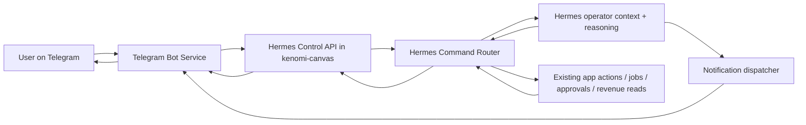

# Telegram Hermes Operator Design

## Goal

Allow the user to operate `kenomi-canvas` through Telegram by talking to a single business operator agent, `Hermes`, that can:

- read the app state,
- answer operational questions,
- trigger a small allowlisted set of low-risk actions,
- send proactive business notifications.

The app remains the source of truth and execution engine. Telegram is only a remote command and notification surface.

## Scope

### In scope for V1

- A dedicated Telegram bot service, separate from the main app.
- A control-plane API in the app for external operator access.
- Hermes as the only conversational operator identity exposed to the user.
- Read commands:
  - `brief`
  - `revenue`
  - `alerts`
  - `approvals`
  - `prospects`
  - natural-language equivalents such as `what should I do now` and `why is cash blocked`
- Low-risk executable commands:
  - `run prospect`
  - `run devops`
  - `scan followups`
  - slash-command equivalents
- Telegram push notifications for:
  - daily brief
  - top business alert
  - action executed
  - action blocked
- Strict policy enforcement, audit logging, and chat allowlisting.

### Out of scope for V1

- WhatsApp support
- multi-user Telegram access
- approval execution from Telegram
- sensitive actions such as `decision`, `scout`, budget changes, payment actions, or offer mutations
- free-form arbitrary tool execution

## Product model

The user does not talk to multiple agents. The user talks to `Hermes`.

Hermes is responsible for:

- interpreting the Telegram message,
- deciding whether the request is read-only or executable,
- routing to the correct app capability,
- refusing anything outside policy,
- returning a concise operator response.

This avoids a weak UX where the user must remember separate bots or agent identities. Internally, Hermes may still delegate to existing app capabilities such as `prospect`, `devops`, or `follow_up_scan`.

## High-level architecture

## Components

### 1. Telegram bot service

Separate deployable service.

Responsibilities:

- receive Telegram webhook events,
- verify the Telegram webhook secret/signature model used,
- allowlist the source `chat_id`,
- normalize inbound messages into a small internal command envelope,
- call the app control-plane API with machine-to-machine authentication,
- format outbound replies and push notifications back to Telegram.

Reasons for keeping it separate:

- cleaner boundary between external channel logic and business app logic,
- easier future extension to WhatsApp or another channel,
- reduced coupling between Telegram-specific payloads and the app.

### 2. Hermes Control API

New app API surface dedicated to external operator access.

Responsibilities:

- authenticate the bot service,
- load the current user context,
- invoke the Hermes command router,
- return structured responses,
- expose notification delivery endpoints if Hermes needs to push outbound events.

This API should not reuse the existing browser chat route. The current `Command Chat` route is Ollama-centric and persists conversation text, but it is not a control-plane for agent actions.

### 3. Hermes Command Router

Central intent layer inside the app.

Responsibilities:

- parse slash commands and natural language requests,
- classify each request into:
  - `read`
  - `execute_low_risk`
  - `refuse`
- map normalized intents to existing app handlers,
- produce a structured operator response with:
  - `summary`
  - `action_taken`
  - `blocked_reason`
  - optional `deep_link`

### 4. Hermes context and reasoning

Reuses the existing Hermes operator foundations:

- daily brief generation
- business alerts
- recommendations
- operator context aggregation

For V1, reasoning should stay shallow and deterministic where possible. Natural language should be translated into a limited operator command vocabulary rather than treated as open-ended agent autonomy.

### 5. Execution layer

Hermes must route only to existing safe capabilities:

- `run prospect`
- `run devops`
- `scan followups`

The actual execution should still go through the existing app patterns:

- `autonomy_jobs`
- `autonomy_actions`
- Hermes policy accounting
- operator audit trails

Telegram must not bypass these app-level controls.

## Command model

### Supported V1 read intents

- `/brief`
- `/revenue`
- `/alerts`
- `/approvals`
- `/prospects`
- natural language:
  - `what should I do now`
  - `why is cash blocked`
  - `show top leaks`

### Supported V1 execution intents

- `/run_prospect`
- `/run_devops`
- `/scan_followups`
- natural language:
  - `run prospect`
  - `launch devops`
  - `scan followups`

### Unsupported intents in V1

The router must explicitly refuse requests such as:

- `approve ...`
- `reject ...`
- `run scout`
- `run decision`
- `increase budget`
- `create checkout`
- `stop venture`
- `change offer`

The refusal response should be explicit and useful:

- what was refused,
- why,
- which surface still supports the action if applicable.

## Policy

### Authorization

V1 is single-operator:

- one Telegram bot token
- one allowlisted Telegram `chat_id`
- one app user identity behind the bot

If a message comes from another chat, the bot ignores it or responds with an unauthorized message without revealing any business state.

### Action policy

Read actions:

- always allowed for the allowlisted chat

Executable actions:

- only:
  - `run prospect`
  - `run devops`
  - `scan followups`

Sensitive actions:

- always denied in V1

### Rate limiting

Both layers should rate-limit:

- Telegram bot service: per chat
- app control plane: per bot client and per user

This protects the app from message storms and accidental loops.

## Notifications

V1 outbound Telegram notifications:

- daily brief
- top business alert
- action executed
- action blocked

Notification rules:

- dedupe repeated alerts,
- preserve existing Hermes dedupe semantics where possible,
- keep messages concise and action-oriented,
- avoid pushing every internal event.

Example messages:

- `Daily brief: 3 approvals pending, 5 follow-ups due, 0€ collected today. Next move: clear approvals.`
- `Blocked cash: reply rate down on best segment. Recommendation: run prospect on warm leads.`
- `Executed: prospect run launched.`
- `Blocked: request refused by policy (approval actions are disabled in Telegram V1).`

## Data flow

### Inbound command flow

1. User sends Telegram message.
2. Telegram delivers webhook to bot service.
3. Bot service verifies source and normalizes message.
4. Bot service calls Hermes Control API.
5. App authenticates bot service and loads the operator user.
6. Hermes command router resolves intent.
7. For reads:
   - gather current app state
   - format concise response
8. For low-risk actions:
   - enqueue or invoke existing app action path
   - persist audit trail
   - return execution result
9. Bot formats and sends reply to Telegram.

### Outbound notification flow

1. Hermes run produces brief/alerts/recommendations.
2. Notification dispatcher selects Telegram-worthy events.
3. App either:
   - pushes directly to bot service webhook, or
   - persists a notification event for bot polling.
4. Bot sends the Telegram message.

For V1, push webhook is preferred over polling because it is simpler to reason about and easier to monitor.

## API design

The app should expose a narrow control API rather than many Telegram-specific endpoints.

### Recommended V1 endpoints

- `POST /api/operator/telegram/command`
  - input:
    - bot auth
    - `chat_id`
    - raw message text
    - optional slash command metadata
  - output:
    - `summary`
    - `intent`
    - `executed`
    - `blocked_reason`
    - `deep_link`

- `POST /api/operator/telegram/notify`
  - optional, only if the bot service is pull-free and the app needs an explicit delivery handoff

- `GET /api/operator/state/*`
  - only if splitting command handling and state reads proves cleaner

The router implementation can still call existing app internals and existing read models. The key requirement is a clean boundary for the external bot.

## Security

### Bot-to-app authentication

Use a dedicated machine-to-machine shared secret, separate from browser auth and separate from internal cron secrets.

Requirements:

- stored only in deploy environment variables,
- rotated independently,
- never reused as a browser token,
- verified on every external operator call.

### Telegram chat allowlist

Store allowed Telegram metadata in operator settings:

- `telegram_bot_enabled`
- `telegram_chat_id`
- optional `telegram_username`

### Audit logging

Every inbound Telegram command must create an audit trail including:

- timestamp
- chat id
- normalized intent
- whether action executed
- refusal or block reason

This is essential because Telegram becomes a remote control surface.

### Refusal by default

If Hermes cannot confidently classify a request into the allowlist:

- do not guess,
- do not partially execute,
- return a refusal and ask for a supported command.

## Error handling

### Bot-level failures

- invalid Telegram payload
- unauthorized chat
- Telegram send failure

Bot should log these and, where possible, retry only outbound delivery, not action execution.

### App-level failures

- Hermes context load failure
- job enqueue failure
- provider timeout
- policy block

App should return structured failure codes, not raw stack traces, and the bot should translate them into operator-readable Telegram responses.

### Reasoning failures

If Hermes reasoning degrades:

- fall back to deterministic command mapping for slash commands,
- use concise degraded-mode messaging for natural language,
- never lose the ability to run supported explicit commands.

## UI impact inside the app

Minimal V1 UI additions only.

Recommended additions:

- Hermes Operator settings:
  - Telegram enabled
  - Telegram notifications enabled
  - chat binding status
- optional operator audit panel:
  - recent Telegram commands
  - executed vs blocked

Avoid building a big Telegram management UI in V1. The main value is the operator loop, not a control dashboard for the bot itself.

## Observability

Track:

- inbound command count
- read vs execute vs refused distribution
- execution latency
- notification delivery success/failure
- blocked-by-policy count
- unsupported command count

This is needed to determine whether Telegram is being used as a real operator surface or just as a novelty layer.

## Testing

### Unit

- intent classification
- slash command parsing
- policy allow/deny
- refusal behavior
- notification formatting

### Integration

- bot service -> app command round trip
- low-risk command execution path
- notification push path

### End-to-end

- Telegram webhook fixture -> command -> app execution -> Telegram reply
- daily brief -> Telegram notification

### Negative coverage

- unauthorized chat
- unsupported command
- command blocked by policy
- Hermes degraded mode

## Rollout

### Phase 1

- Telegram bot service
- Hermes Control API
- read-only commands

### Phase 2

- low-risk command execution
- audit logging
- metrics

### Phase 3

- Telegram notifications
- delivery monitoring
- operator settings polish

## Success criteria

V1 is successful if all of the following are true:

- the user can ask Hermes for the current business state from Telegram,
- the user can trigger `prospect`, `devops`, and `follow_up_scan` from Telegram,
- unsupported or risky commands are explicitly refused,
- Telegram notifications deliver the daily brief and meaningful business alerts,
- every Telegram-triggered action is auditable in the app.

## Explicit non-goals

This design does not try to make Telegram the entire product surface.

The app stays:

- the system of record,
- the execution engine,
- the place for deep inspection and manual overrides.

Telegram is a remote operator console, not a replacement for the Studio.
